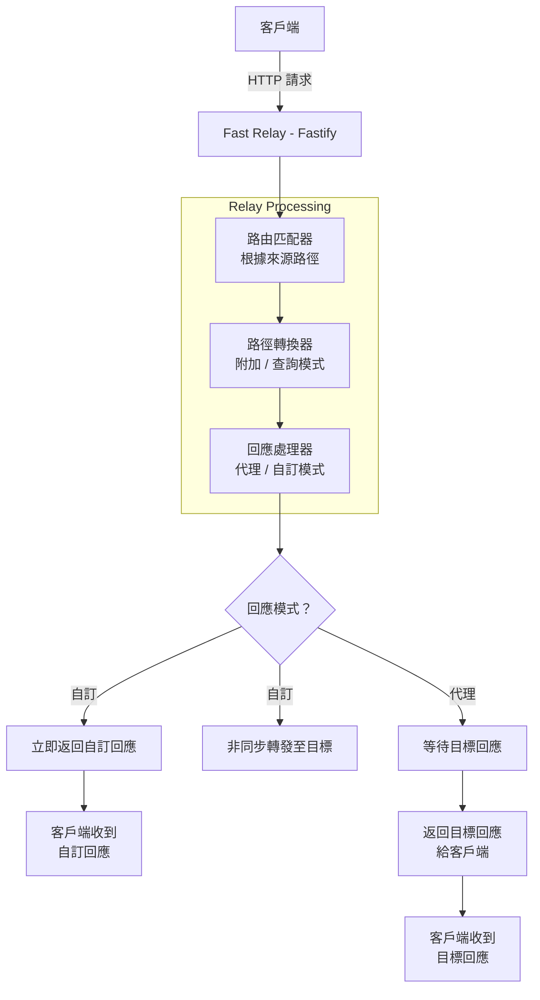
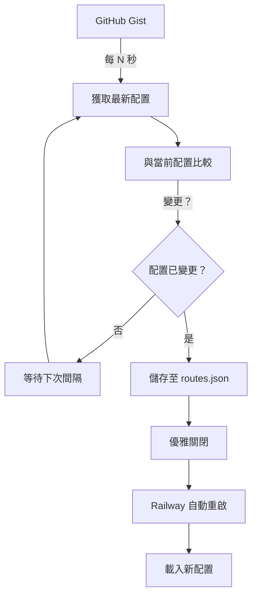

# Fast Relay

[English](README.md) | [繁體中文](README.zh-TW.md)

輕量級、靈活的 HTTP 代理路由器，支援透過 GitHub Gist 動態配置。

[](https://railway.com/deploy/6Mtv9w?referralCode=EnYHPz)

## ✨ 特色功能

- 🚀 **零配置部署** - 數秒內部署至 Railway
- 📝 **JSON 路由配置** - 簡單、易讀的路由設定
- 🔄 **動態配置** - 透過 GitHub Gist 更新路由，無需重新部署
- 🎯 **靈活的路徑模式** - 支援路徑附加或查詢參數路由
- ⚡ **自訂回應** - 即發即忘的非同步轉發，立即回應客戶端
- 🛡️ **生產就緒** - 基於 Fastify 打造，高效能運行
- 📊 **詳細日誌** - 追蹤所有請求與回應

## 🎯 使用場景

- **Webhook 轉發** - 將外部服務的 webhook 路由至您的後端
- **API 聚合** - 在單一端點下整合多個後端 API
- **A/B 測試** - 根據路徑將流量導向不同後端
- **開發代理** - 將本地開發流量代理至測試/生產環境
- **舊版 API 遷移** - 透過路由特定路徑逐步遷移 API

## 🚀 快速開始

### 選項 1：部署至 Railway（推薦）

1. 點擊上方的 "Deploy on Railway" 按鈕
2. 配置環境變數（可選）
3. 完成！您的代理服務已上線

### 選項 2：本地開發

```bash
# 複製儲存庫
git clone https://github.com/yourusername/fast-relay.git
cd fast-relay

# 安裝依賴
yarn install

# 啟動開發伺服器
yarn dev

# 建置生產版本
yarn build
yarn start:prod
```

## 📋 配置說明

### 配置優先順序

應用程式遵循以下優先順序：

1. **GitHub Gist**（如果設定了 `GIST_URL` 或 `GIST_ID`）
   - 啟動時獲取配置
   - 定期自動同步
   - 變更時自動重啟

2. **本地 `routes.json` 檔案**
   - 首次執行時自動從 `routes.example.json` 建立
   - 被 Git 忽略（可加入自訂配置）

3. **環境變數**（舊版，不建議使用）
   - `PROXY_ROUTES` 或 `TARGET_URLS`

### 路由配置格式

建立或編輯 `routes.json`：

```json
{
  "$schema": "./routes.schema.json",
  "routes": [
    {
      "source": "/api/v1/*",
      "target": "https://users-api.example.com/v1",
      "description": "主要 API 端點",
      "pathMode": "append",
      "responseMode": "proxy"
    },
    {
      "source": "/webhook/*",
      "target": "https://webhooks.example.com/hooks",
      "description": "Webhook 接收器",
      "pathMode": "query",
      "queryParamName": "path",
      "responseMode": "custom",
      "customResponse": {
        "status": 200,
        "headers": {
          "Content-Type": "application/json"
        },
        "body": {
          "success": true,
          "message": "Webhook received"
        }
      }
    }
  ]
}
```

### 配置選項

#### 路由屬性

| 屬性 | 類型 | 必填 | 預設值 | 說明 |
|------|------|------|--------|------|
| `source` | string | ✅ | - | 來源路徑模式（使用 `/*` 表示萬用字元） |
| `target` | string | ✅ | - | 目標 URL（包含協定的完整 URL） |
| `description` | string | ❌ | - | 易讀的描述 |
| `pathMode` | string | ❌ | `"append"` | 萬用字元路徑處理方式：`"append"` 或 `"query"` |
| `queryParamName` | string | ❌ | `"path"` | 使用 `pathMode: "query"` 時的查詢參數名稱 |
| `responseMode` | string | ❌ | `"proxy"` | 回應處理方式：`"proxy"` 或 `"custom"` |
| `customResponse` | object | ❌ | - | 自訂回應配置（`responseMode: "custom"` 時必填） |

#### 路徑模式

**附加模式（Append Mode）**（預設）
```
請求：    /api/v1/users/123
目標：    https://users-api.example.com/v1
結果：    https://users-api.example.com/v1/users/123
```

**查詢模式（Query Mode）**
```
請求：    /api/v2/orders/123
目標：    https://orders-api.example.com/v2
結果：    https://orders-api.example.com/v2?path=/orders/123
```

#### 回應模式

**代理模式（Proxy Mode）**（預設）
- 等待目標伺服器回應
- 將目標伺服器的回應返回給客戶端
- 適用於：API、同步操作

**自訂模式（Custom Mode）**
- 立即返回自訂回應
- 非同步轉發請求至目標伺服器（即發即忘）
- 在背景記錄目標伺服器回應
- 適用於：Webhook、非同步通知、狀態端點

### 自訂回應配置

```json
{
  "customResponse": {
    "status": 200,
    "headers": {
      "Content-Type": "application/json",
      "X-Custom-Header": "value"
    },
    "body": {
      "success": true,
      "message": "Request received"
    }
  }
}
```

或簡單的文字回應：

```json
{
  "customResponse": {
    "status": 202,
    "body": "Accepted"
  }
}
```

## 🔧 環境變數

### 基本配置

```env
# 伺服器設定
PORT=8080
HOST=0.0.0.0
```

### GitHub Gist 配置

#### 選項 1：公開 Gist（簡單）

```env
# 使用您的 Gist raw URL
GIST_URL=https://gist.githubusercontent.com/username/gist-id/raw/routes.json

# 同步間隔秒數（預設：300，設為 0 停用）
GIST_SYNC_INTERVAL=300

# 配置變更時自動重啟（預設：true）
GIST_AUTO_RESTART=true
```

#### 選項 2：私密 Gist（安全）

```env
# 您的 Gist ID
GIST_ID=your-gist-id

# GitHub Personal Access Token（權限範圍：gist）
# 在此建立：https://github.com/settings/tokens
GITHUB_TOKEN=ghp_xxxxxxxxxxxxxxxxxxxxxxxxxxxxx

# 同步間隔秒數（預設：300，設為 0 停用）
GIST_SYNC_INTERVAL=300

# 配置變更時自動重啟（預設：true）
GIST_AUTO_RESTART=true
```

### 舊版配置（不建議）

```env
# 逗號分隔的路由定義
PROXY_ROUTES=/api/v1/*->https://api.example.com/v1,/webhook->https://webhooks.example.com/hooks

# 或簡單的目標 URL
TARGET_URLS=https://api.example.com
```

## 📚 GitHub Gist 設定指南

### 步驟 1：建立 Gist

1. 前往 https://gist.github.com/
2. 建立名為 `routes.json` 的新檔案
3. 貼上您的路由配置
4. 選擇「建立私密 gist」（推薦）或「建立公開 gist」

### 步驟 2：取得 Raw URL

1. 開啟您的 Gist
2. 點擊「Raw」按鈕（檔案右上方）
3. 複製 URL（格式類似 `https://gist.githubusercontent.com/username/abc123.../raw/routes.json`）

### 步驟 3：配置 Railway

在 Railway 中：
1. 前往您的專案設定
2. 新增環境變數：
   ```
   GIST_URL=<your-raw-url>
   GIST_SYNC_INTERVAL=30
   GIST_AUTO_RESTART=true
   ```
3. 重新部署（或等待自動部署）

### 步驟 4：更新配置

1. 在 GitHub 上編輯您的 Gist
2. 點擊「更新私密 gist」
3. 等待 30 秒（或您設定的間隔時間）
4. 應用程式自動以新配置重啟！✨

### 私密 Gist 設定

如果您想保持配置私密：

1. 建立 Personal Access Token：
   - 前往 https://github.com/settings/tokens
   - 點擊「Generate new token (classic)」
   - 選擇權限範圍：**gist**（僅此項）
   - 產生並複製 token

2. 配置 Railway：
   ```env
   GIST_ID=your-gist-id
   GITHUB_TOKEN=ghp_xxxxxxxxxxxxx
   GIST_SYNC_INTERVAL=30
   ```

## 🔍 API 端點

### 健康檢查

```bash
GET /health
```

回應：
```json
{
  "status": "ok",
  "timestamp": "2025-10-15T00:00:00.000Z"
}
```

### 代理路由

所有配置的路由會根據您的 `routes.json` 配置自動註冊。

## 📊 日誌記錄

應用程式提供詳細的日誌，便於除錯和監控：

```
[INFO] 🔄 Gist sync enabled, initializing configuration...
[INFO] ✅ Gist configuration loaded successfully (Raw URL)
[INFO] 💾 Configuration saved to local file
[INFO] 🎯 Route mappings:
[INFO]    /api/v1/* → https://users-api.example.com/v1 [append]
[INFO]    /webhook/* → https://webhooks.example.com/hooks [query: path] [custom response]
[INFO] 🚀 Proxy server started successfully!
[INFO] 📍 Listening at: http://0.0.0.0:8080
[INFO] 🔄 Gist configuration sync started {"intervalSeconds":300,"autoRestart":true}
```

### 請求日誌

**附加模式：**
```
[INFO] 📨 Request forwarding (Append mode) {
  "method": "POST",
  "from": "/api/v1/users",
  "to": "https://users-api.example.com/v1/users",
  "mode": "append"
}
```

**查詢模式與自訂回應：**
```
[INFO] 📨 Request forwarding (Query mode) {
  "method": "POST",
  "from": "/webhook/test",
  "to": "https://webhooks.example.com/hooks?path=/test",
  "mode": "query",
  "responseMode": "custom",
  "wildcardPath": "/test",
  "queryParam": "path=/test"
}
[INFO] ✅ Target response (Custom mode - async) {
  "targetUrl": "https://webhooks.example.com/hooks?path=/test",
  "status": 200,
  "responseTime": 156,
  "responseBody": "{\"success\":true,\"path\":\"/test\"...}"
}
```

## 🏗️ 架構

### 技術堆疊

- **Fastify 5.x** - 高效能 Web 框架
- **TypeScript** - 型別安全開發
- **@fastify/http-proxy** - 代理中介軟體（附加模式）
- **Native Fetch API** - 請求轉發（查詢模式）
- **Pino** - 快速日誌記錄

### 請求流程



### 動態配置同步



## 🧪 測試

```bash
# 執行開發伺服器
yarn dev

# 測試路由
curl http://localhost:8080/api/v1/test

# 檢查健康狀態
curl http://localhost:8080/health
```

## 🚢 部署

### Railway

1. Fork 此儲存庫
2. 連接至 Railway
3. 配置環境變數
4. 部署！

Railway 將自動：
- 偵測建置配置
- 安裝依賴
- 建置 TypeScript
- 啟動伺服器
- 崩潰時重啟

### Docker（即將推出）

```bash
# 建置
docker build -t fast-relay .

# 執行
docker run -p 8080:8080 \
  -e GIST_URL=your-gist-url \
  fast-relay
```

## 📖 範例

### 範例 1：帶自訂回應的 Webhook 轉發

**情境：** 從外部服務轉發 webhook，並立即回應。

```json
{
  "routes": [
    {
      "source": "/webhook/*",
      "target": "https://webhooks.example.com/hooks",
      "description": "帶自訂回應的 Webhook 接收器",
      "pathMode": "query",
      "queryParamName": "path",
      "responseMode": "custom",
      "customResponse": {
        "status": 200,
        "body": "OK"
      }
    }
  ]
}
```

外部服務立即收到 "OK" 回應，webhook 則在背景處理。

### 範例 2：API 聚合

**情境：** 在單一代理後整合多個微服務。

```json
{
  "routes": [
    {
      "source": "/users/*",
      "target": "https://users-service.example.com/api",
      "pathMode": "append",
      "description": "使用者服務"
    },
    {
      "source": "/orders/*",
      "target": "https://orders-service.example.com/api",
      "pathMode": "append",
      "description": "訂單服務"
    },
    {
      "source": "/payments/*",
      "target": "https://payments-service.example.com/api",
      "pathMode": "append",
      "description": "付款服務"
    }
  ]
}
```

### 範例 3：開發/測試環境路由

**情境：** 將特定路徑路由至測試環境。

```json
{
  "routes": [
    {
      "source": "/api/beta/*",
      "target": "https://staging-api.example.com/v1",
      "description": "測試環境的 Beta 功能",
      "pathMode": "append"
    },
    {
      "source": "/api/*",
      "target": "https://api.example.com/v1",
      "description": "生產環境 API",
      "pathMode": "append"
    }
  ]
}
```

## 📝 授權

MIT License - 詳見 [LICENSE](LICENSE) 檔案
