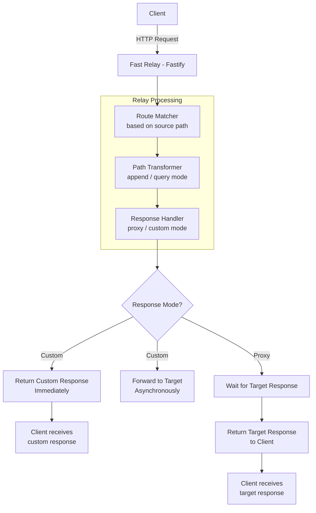
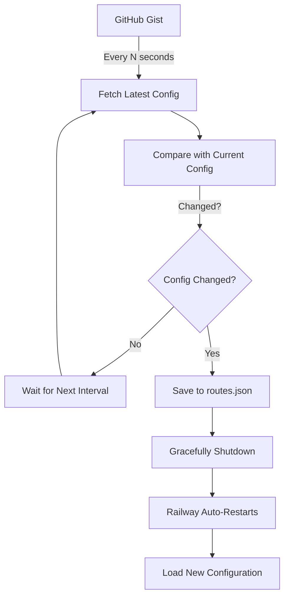

# Architecture & Logging

Technical architecture and logging guide for Fast Relay.

## Technology Stack

- **Fastify 5.x** - High-performance web framework optimized for speed
- **TypeScript** - Type-safe development with modern ES features
- **@fastify/http-proxy** - Proxy middleware for append mode routing
- **@fastify/formbody** - Form URL-encoded body parser
- **@fastify/multipart** - Multipart form-data and file upload support
- **Native Fetch API** - Modern request forwarding for query mode
- **Pino** - Fast, low-overhead logging
- **dotenv** - Environment variable management
- **form-data** - Multipart form-data stream handling

## System Architecture

### Request Flow



### Dynamic Configuration Sync



## Core Components

### 1. Server Initialization (`server.ts`)

**Responsibilities:**
- Fastify app setup and configuration
- Plugin registration (CORS, rate limiting, body parsers)
- Route loading and validation
- Health check endpoint
- Graceful shutdown handling

**Key features:**
- Environment-based logging (pretty/JSON)
- Body size limits (default 10MB)
- Request ID generation
- Error handling

### 2. Route Configuration Loader

**Priority order:**
1. GitHub Gist (if configured)
2. Local `routes.json` file
3. Environment variables (legacy)

**Validation:**
- JSON syntax
- Required fields
- URL format
- SSRF protection
- Domain whitelist

### 3. Gist Sync Service (`gist-config.ts`)

**Features:**
- Periodic configuration fetching
- Change detection (SHA comparison)
- Auto-restart on changes
- Token masking in logs
- Timeout handling

**Flow:**
```
1. Fetch Gist content
2. Compare SHA with current
3. If changed:
   a. Validate new config
   b. Save to routes.json
   c. Trigger graceful shutdown
   d. Platform restarts service
```

### 4. Authentication Middleware (`auth-middleware.ts`)

**Features:**
- Multiple authentication methods
- Token masking
- Public endpoint exceptions (`/health`)
- Validation and error handling

**Methods:**
1. Bearer token: `Authorization: Bearer <key>`
2. API key header: `X-API-Key: <key>`
3. Query parameter: `?api_key=<key>`

### 5. URL Validator (`url-validator.ts`)

**SSRF Protection:**
- Blocks private IP ranges
- Blocks localhost
- Blocks cloud metadata services
- Protocol validation (http/https only)

**Domain Whitelist:**
- Wildcard subdomain support
- Exact domain matching
- Multiple domain support

### 6. Request Handler

**Append Mode:**
- Uses `@fastify/http-proxy`
- Direct stream proxying
- Efficient for large payloads

**Query Mode:**
- Uses native Fetch API
- Custom header handling
- Query parameter injection

**Custom Response:**
- Immediate client response
- Async target forwarding
- Background logging

## Logging

### Log Levels

- `info` - Normal operations, requests, responses
- `warn` - Non-critical issues, validation warnings
- `error` - Errors, failed requests, configuration issues
- `debug` - Detailed debugging (development only)

### Log Format

**Development (`NODE_ENV=development`):**
```
[INFO] 🚀 Proxy server started successfully!
[INFO] 📍 Listening at: http://0.0.0.0:8080
```

**Production (`NODE_ENV=production`):**
```json
{"level":30,"time":1697328000000,"msg":"Proxy server started successfully","hostname":"app-123","pid":1}
```

### Request Logging

**Append Mode:**
```
[INFO] 📨 Request forwarding (Append mode) {
  "method": "POST",
  "from": "/api/v1/users",
  "to": "https://users-api.example.com/v1/users",
  "mode": "append"
}
```

**Query Mode:**
```
[INFO] 📨 Request forwarding (Query mode) {
  "method": "POST",
  "from": "/webhook/test",
  "to": "https://webhooks.example.com/hooks?path=/test",
  "mode": "query",
  "responseMode": "custom",
  "wildcardPath": "/test",
  "queryParam": "path=/test"
}
```

**Custom Response (Async):**
```
[INFO] ✅ Target response (Custom mode - async) {
  "targetUrl": "https://webhooks.example.com/hooks?path=/test",
  "status": 200,
  "responseTime": 156,
  "responseBody": "{\"success\":true,\"path\":\"/test\"...}"
}
```

### Configuration Logging

**Startup:**
```
[INFO] 🔄 Gist sync enabled, initializing configuration...
[INFO] ✅ Gist configuration loaded successfully (Raw URL)
[INFO] 💾 Configuration saved to local file
[INFO] 🎯 Route mappings:
[INFO]    /api/v1/* → https://users-api.example.com/v1 [append]
[INFO]    /webhook/* → https://webhooks.example.com/hooks [query: path] [custom response]
[INFO] 🚀 Proxy server started successfully!
[INFO] 📍 Listening at: http://0.0.0.0:8080
[INFO] 🔄 Gist configuration sync started {"intervalSeconds":300,"autoRestart":true}
```

**Configuration Update:**
```
[INFO] 🔄 Checking for Gist configuration updates...
[INFO] 📝 Configuration changed detected (SHA mismatch)
[INFO] ✅ New configuration validated successfully
[INFO] 💾 Configuration saved to routes.json
[INFO] 🔄 Restarting to apply new configuration...
```

**Token Masking:**
```
[INFO] 🔑 GitHub token configured: ghp_...wxyz
```

### Error Logging

**Configuration Error:**
```
[ERROR] ❌ Failed to load configuration: Invalid JSON syntax
[ERROR]    File: routes.json
[ERROR]    Error: Unexpected token } in JSON at position 123
```

**SSRF Protection:**
```
[ERROR] 🚫 SSRF protection triggered
[ERROR]    Target URL: http://169.254.169.254/latest/meta-data
[ERROR]    Reason: Target URL contains private/reserved IP address
```

**Authentication Error:**
```
[WARN] 🔒 Authentication failed
[WARN]    IP: 192.168.1.100
[WARN]    Reason: Invalid or missing API key
```

## Performance Considerations

### Response Times

**Append Mode (Proxy):**
- Overhead: ~1-5ms
- Total time: Target response time + overhead

**Query Mode (Proxy):**
- Overhead: ~2-8ms
- Total time: Target response time + overhead

**Custom Response:**
- Response time: ~1-3ms (immediate)
- Target forwarding: Async (doesn't affect client)

### Memory Usage

**Baseline:** ~30-50MB
**Per request:** ~0.5-2MB (temporary)
**With file uploads:** Depends on BODY_LIMIT

### Scaling

**Vertical (Single Instance):**
- Handles ~10,000 req/s (simple proxying)
- Handles ~5,000 req/s (with authentication)
- Limited by CPU and network

**Horizontal (Multiple Instances):**
- Stateless design (fully horizontal-scalable)
- Load balancer distributes traffic
- Shared configuration via Gist

## Deployment Architecture

### Railway (Recommended)

```
┌─────────────┐
│  GitHub     │
│  Gist       │
│  (Config)   │
└─────┬───────┘
      │ HTTP
      │
┌─────▼───────────────────────────────┐
│  Railway                             │
│  ┌────────────────────────────────┐ │
│  │  Fast Relay Instance           │ │
│  │  - Auto-restart on changes     │ │
│  │  - Environment variables       │ │
│  │  - Auto-scaling (optional)     │ │
│  └────────────────────────────────┘ │
└──────────────────────────────────────┘
      │ HTTPS
      │
┌─────▼───────┐
│  Backend    │
│  Services   │
└─────────────┘
```

### Docker (Self-Hosted)

```
┌──────────────────────────────────────┐
│  Host Server                          │
│  ┌────────────────────────────────┐  │
│  │  Docker Container              │  │
│  │  - Fast Relay                  │  │
│  │  - Port mapping: 8080:8080    │  │
│  │  - Volume: .env                │  │
│  └────────────────────────────────┘  │
└──────────────────────────────────────┘
```

## Monitoring & Observability

### Health Check

```bash
GET /health

Response:
{
  "status": "ok",
  "timestamp": "2025-10-15T00:00:00.000Z"
}
```

### Metrics to Monitor

**Application:**
- Request rate
- Response times
- Error rates
- Auth failures

**System:**
- CPU usage
- Memory usage
- Network I/O
- Disk usage

**Business:**
- Route usage
- Client distribution
- Peak traffic times

### Recommended Tools

- **Logging:** Datadog, New Relic, Papertrail
- **Monitoring:** Grafana, Prometheus
- **Alerts:** PagerDuty, Opsgenie
- **APM:** New Relic, Datadog APM

## Related Documentation

- [Configuration Guide](CONFIGURATION.md) - Route configuration
- [Environment Variables](ENVIRONMENT.md) - All environment settings
- [Security Guide](SECURITY.md) - Security best practices
- [Examples](EXAMPLES.md) - Real-world configurations
