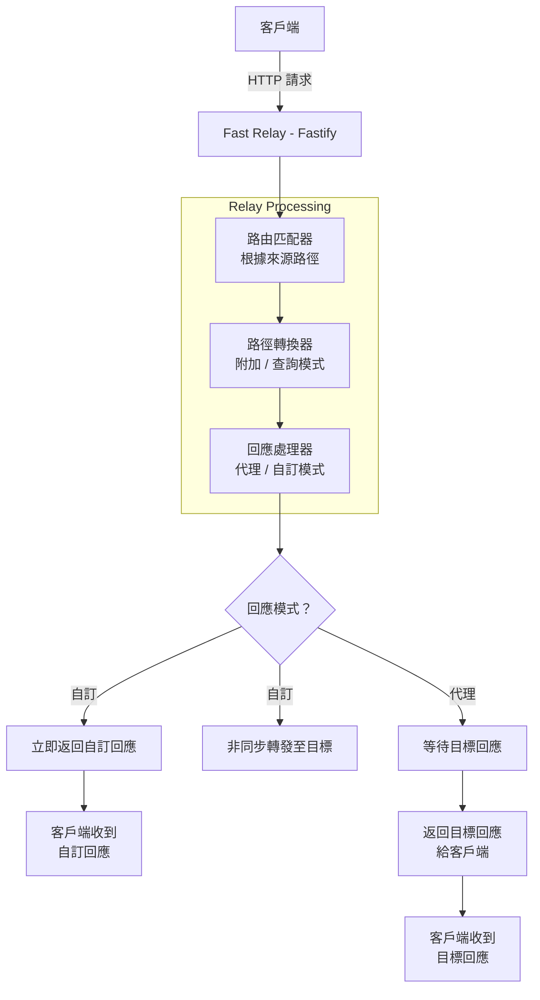
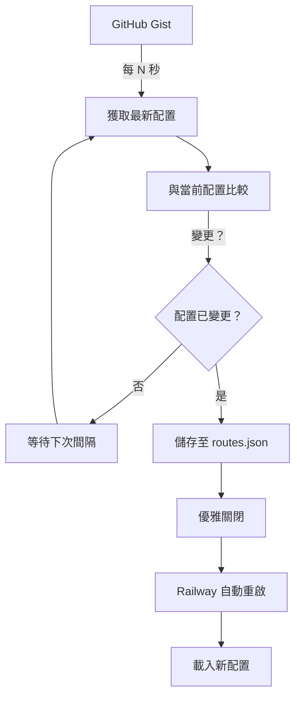

# 架構與日誌

Fast Relay 的技術架構和日誌指南。

## 技術堆疊

- **Fastify 5.x** - 針對速度最佳化的高效能 Web 框架
- **TypeScript** - 具備現代 ES 功能的型別安全開發
- **@fastify/http-proxy** - 用於附加模式路由的代理中介軟體
- **@fastify/formbody** - Form URL-encoded 本文解析器
- **@fastify/multipart** - Multipart form-data 和檔案上傳支援
- **Native Fetch API** - 用於查詢模式的現代請求轉發
- **Pino** - 快速、低開銷日誌記錄
- **dotenv** - 環境變數管理
- **form-data** - Multipart form-data 串流處理

## 系統架構

### 請求流程



### 動態配置同步



## 核心元件

### 1. 伺服器初始化（`server.ts`）

**職責：**
- Fastify 應用程式設定和配置
- 外掛註冊（CORS、速率限制、本文解析器）
- 路由載入和驗證
- 健康檢查端點
- 優雅關閉處理

**主要功能：**
- 基於環境的日誌記錄（美化/JSON）
- 本文大小限制（預設 10MB）
- 請求 ID 產生
- 錯誤處理

### 2. 路由配置載入器

**優先順序：**
1. GitHub Gist（如果已配置）
2. 本地 `routes.json` 檔案
3. 環境變數（舊版）

**驗證：**
- JSON 語法
- 必填欄位
- URL 格式
- SSRF 防護
- 域名白名單

### 3. Gist 同步服務（`gist-config.ts`）

**功能：**
- 定期獲取配置
- 變更檢測（SHA 比較）
- 變更時自動重啟
- 日誌中的 Token 遮罩
- 超時處理

### 4. 認證中介軟體（`auth-middleware.ts`）

**功能：**
- 多種認證方式
- Token 遮罩
- 公開端點例外（`/health`）
- 驗證和錯誤處理

### 5. URL 驗證器（`url-validator.ts`）

**SSRF 防護：**
- 阻擋私有 IP 範圍
- 阻擋 localhost
- 阻擋雲端 metadata 服務
- 協定驗證（僅 http/https）

### 6. 請求處理器

**附加模式：**
- 使用 `@fastify/http-proxy`
- 直接串流代理
- 對大型載荷有效率

**查詢模式：**
- 使用原生 Fetch API
- 自訂標頭處理
- 查詢參數注入

**自訂回應：**
- 立即客戶端回應
- 非同步目標轉發
- 背景日誌記錄

## 日誌記錄

### 日誌級別

- `info` - 正常操作、請求、回應
- `warn` - 非關鍵問題、驗證警告
- `error` - 錯誤、失敗的請求、配置問題
- `debug` - 詳細除錯（僅開發環境）

### 日誌格式

**開發環境（`NODE_ENV=development`）：**
```
[INFO] 🚀 Proxy server started successfully!
[INFO] 📍 Listening at: http://0.0.0.0:8080
```

**生產環境（`NODE_ENV=production`）：**
```json
{"level":30,"time":1697328000000,"msg":"Proxy server started successfully","hostname":"app-123","pid":1}
```

### 請求日誌

**附加模式：**
```
[INFO] 📨 Request forwarding (Append mode) {
  "method": "POST",
  "from": "/api/v1/users",
  "to": "https://users-api.example.com/v1/users",
  "mode": "append"
}
```

**查詢模式：**
```
[INFO] 📨 Request forwarding (Query mode) {
  "method": "POST",
  "from": "/webhook/test",
  "to": "https://webhooks.example.com/hooks?path=/test",
  "mode": "query",
  "responseMode": "custom",
  "wildcardPath": "/test",
  "queryParam": "path=/test"
}
```

## 效能考量

### 回應時間

**附加模式（代理）：**
- 開銷：約 1-5ms
- 總時間：目標回應時間 + 開銷

**查詢模式（代理）：**
- 開銷：約 2-8ms
- 總時間：目標回應時間 + 開銷

**自訂回應：**
- 回應時間：約 1-3ms（立即）
- 目標轉發：非同步（不影響客戶端）

### 記憶體使用

**基準：** 約 30-50MB
**每次請求：** 約 0.5-2MB（暫時）
**檔案上傳：** 取決於 BODY_LIMIT

### 擴展

**垂直擴展（單一實例）：**
- 處理約 10,000 req/s（簡單代理）
- 處理約 5,000 req/s（帶認證）
- 受 CPU 和網路限制

**水平擴展（多個實例）：**
- 無狀態設計（完全可水平擴展）
- 負載平衡器分配流量
- 透過 Gist 共享配置

## 部署架構

### Railway（推薦）

```
┌─────────────┐
│  GitHub     │
│  Gist       │
│  (Config)   │
└─────┬───────┘
      │ HTTP
      │
┌─────▼───────────────────────────────┐
│  Railway                             │
│  ┌────────────────────────────────┐ │
│  │  Fast Relay Instance           │ │
│  │  - 變更時自動重啟              │ │
│  │  - 環境變數                    │ │
│  │  - 自動擴展（可選）            │ │
│  └────────────────────────────────┘ │
└──────────────────────────────────────┘
      │ HTTPS
      │
┌─────▼───────┐
│  後端       │
│  服務       │
└─────────────┘
```

## 監控與可觀察性

### 健康檢查

```bash
GET /health

回應：
{
  "status": "ok",
  "timestamp": "2025-10-15T00:00:00.000Z"
}
```

### 需要監控的指標

**應用程式：**
- 請求率
- 回應時間
- 錯誤率
- 認證失敗

**系統：**
- CPU 使用率
- 記憶體使用率
- 網路 I/O
- 磁碟使用率

**業務：**
- 路由使用率
- 客戶端分布
- 尖峰流量時間

### 建議工具

- **日誌記錄：** Datadog、New Relic、Papertrail
- **監控：** Grafana、Prometheus
- **警報：** PagerDuty、Opsgenie
- **APM：** New Relic、Datadog APM

## 相關文件

- [配置指南](CONFIGURATION.zh-TW.md) - 路由配置
- [環境變數](ENVIRONMENT.zh-TW.md) - 所有環境設定
- [安全性指南](SECURITY.zh-TW.md) - 安全性最佳實踐
- [使用範例](EXAMPLES.zh-TW.md) - 實際配置
